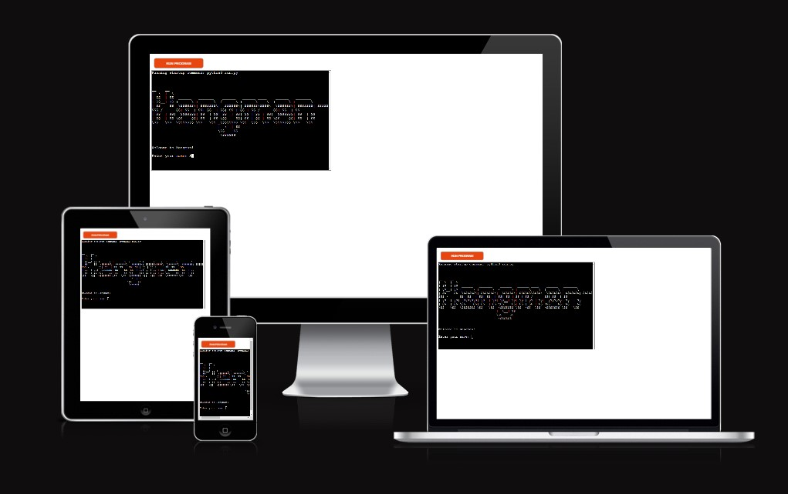
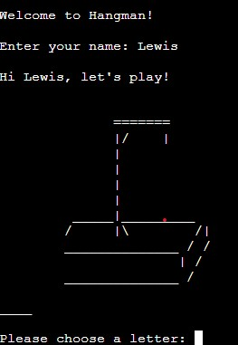
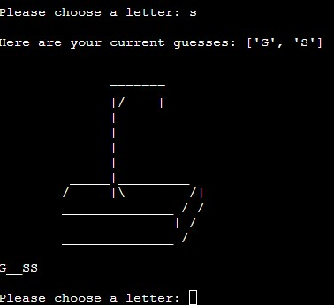
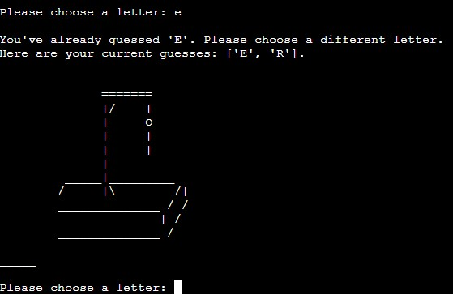
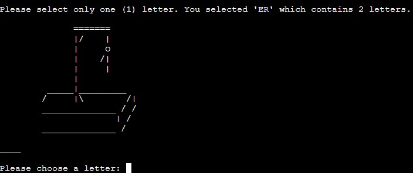
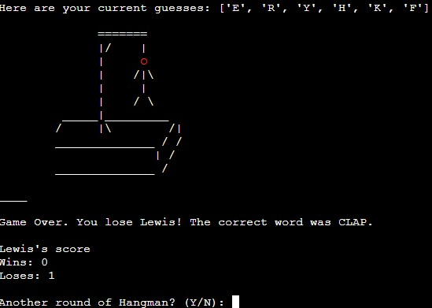
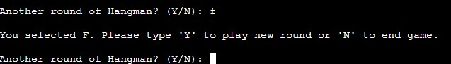
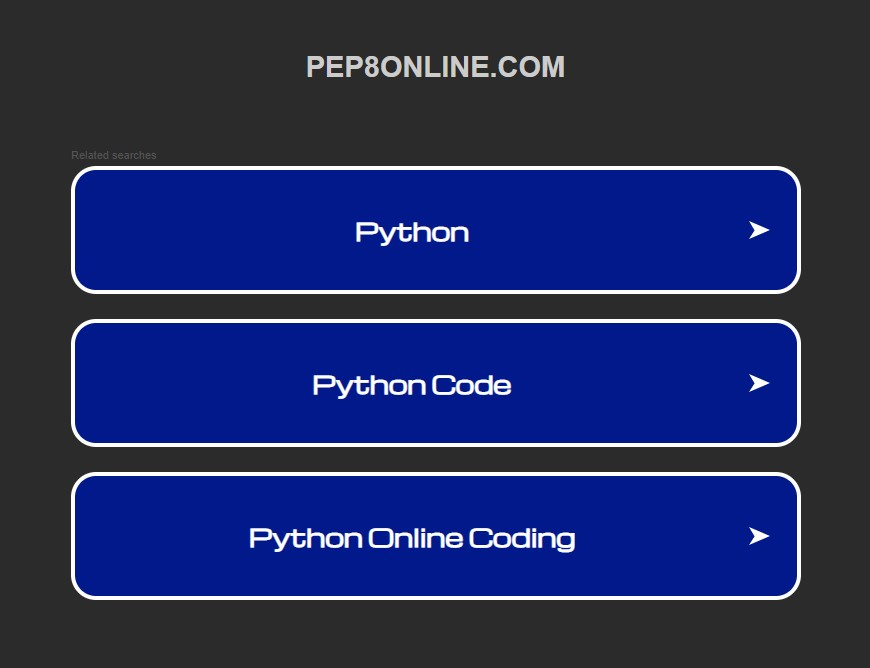

# Hangman
Hangman is an old school, popular game which is suitable for all ages. The point of the game is to test the player's vocabulary by guessing one letter at a time to solve the word puzzle.

For the player to win the game they must guess each world correctly within a certain amount of lives.

Live site: https://hangman-game-using-python.herokuapp.com/
  

 

## Contents

[How to play](https://github.com/lewis-worsley/hangman/blob/main/README.md#howtoplay)

[Features](https://github.com/lewis-worsley/hangman/blob/main/README.md#features)

[Testing](https://github.com/lewis-worsley/hangman/blob/main/README.md#testing)

[Deployment](https://github.com/lewis-worsley/hangman/blob/main/README.md#deployment)

[Languages](https://github.com/lewis-worsley/hangman/blob/main/README.md#languages)

[Credits](https://github.com/lewis-worsley/hangman/blob/main/README.md#credits)

 

## How to play

The aim of the game is for the player to correctly guess the hidden word that is randomly chosen by the computer. If all the letters in the word have been guessed correctly - within the given amount of lives (which is 6) - then the player has the game.

To play the user must type a single letter into the terminal. However, if the player was to submit an incorrect command, the terminal will prompt the player to pick another letter, whilst explaining why their last command didn't work.

If all letter have been guessed correctly or their lives fall to zero the game is over.

The hidden word will look like this (length will vary): _ _ _ _ _ _

As the player guesses letter, it will begin to look similar to this example: _ R _ V E_

## Features

- Player enters name
- Player is prompted to choose a letter

- The hangman graphic changes which is dependent if the guess is correct and how many lives are left.
- The game reminds the player which letters they have selected so far.

- The player is reminded they can only choose one letter at a time.

- The player is reminded they can only choose one character at a time.

- The player continues to play until he/she wins or they run out of lives.
- The player is shown their current win and lost record which is updated after every round until the user decides to end the game.

- The player has the option to restart new round or end the game

 

## Testing

I have manually tested the project by doing the following:

- Tested user inputs by checking if the game runs as expected. This includes inputting incorrect data.
- Tested in the local terminal and on the mock terminal on the deployed site on Heroku.

 

### Bugs

- Player scores would not update after each round. This was fixed by moving their respective variables outside the function and adding a global scope to the variables in the play_game().
- The goodbye screen would repeat it multiple times depending on how many times the player decided to play. To fix this, an exit() was added.
- ASCII Art Generator: after testing the game, the font art style for opening title and goodbye screens appeared to cause alignment issues where the art wouldn't remain intact. So I decided to remove the art and replace them with text.

 

### Remaining Bugs

- No bugs remaining

 

### Validator Testing

- Code Institute's recommendation to use http://ww7.pep8online.com/ as a Python validation tool does not work. I get presented with these options, and after I click each option I get sent to different forms of marketing landing pages.
- Despite my search on search engines, I've not been able to confidently use anoher Python validation tool to check my code for validation.

 

## Deployment

The project was deployed using Code Institutes mock terminal for Heroku.

- Steps to deploy:
  - Create a new app in Heroku.
  - Select "New" and "Create new app".
  - Name the new app and click "Create new app".
  - In "Settings" select "BuildPack" and select Python and Node.js. (Python must be at the top of the list).
  - Whilst still in "Settings", click "Reveal Config Vars" and input the folloing. KEY: PORT, VALUE: 8000. Nothing else is needed here as this project does not have any sensitive files.
  - Click on "Deploy" and select your deploy method and repository.
  - Click "Connect" on selected repository.
  - Either choose "Enable Automatic Deploys" or "Deploy Branch" in the manual deploy section.
  -  Heroku will now deploy the site.

 

## Languages

The coding languages used:

- Python

 

## Credits

To help bring this project to life, the following deserve recognition:

 

### Content

- https://www.reddit.com/r/learnpython/comments/2dtjzh/how_to_increment_a_global_variable_when_a/: helped solve the issue on player score
- Random Word Generator: generating a list of random words for the Hangman to be able to function.

 

### Thanks

- Richard Wells (Code Institute mentor)
    - His feedback and guidance throughout helped me develop the game but also improve my understanding of Python.